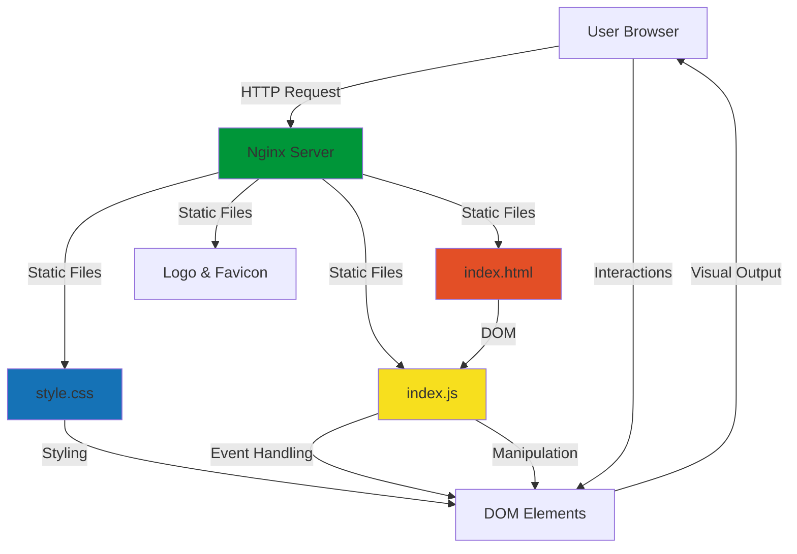
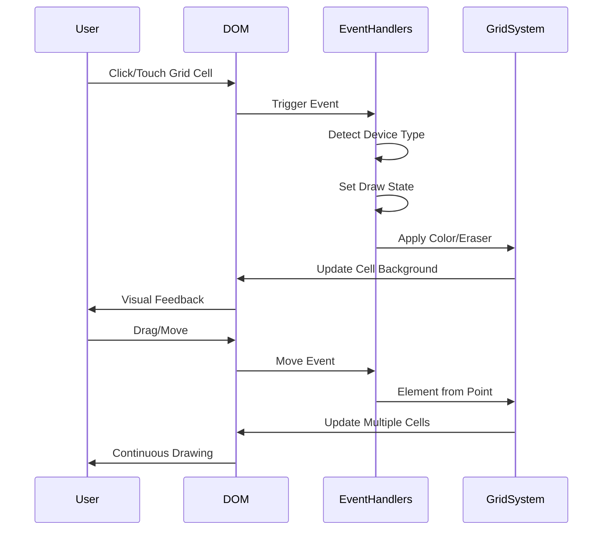
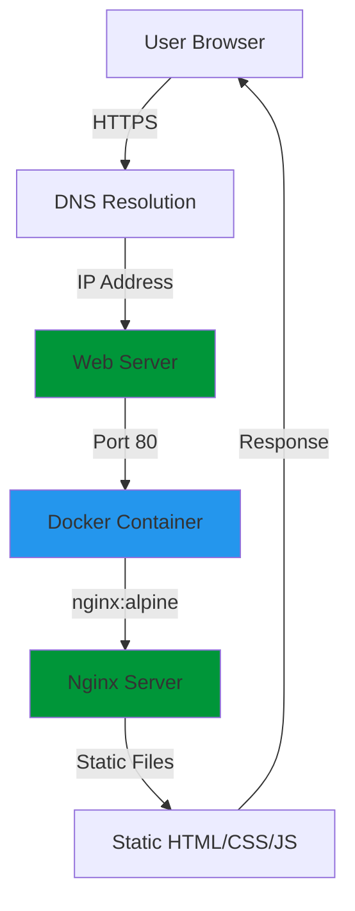

# Pixel Forge

# Professional pixel art editor with intuitive controls for creating stunning digital artwork.

# Product Type

Static Web Application - Client-side pixel art editor built with pure HTML, CSS, and JavaScript.

# Maintainer / Organization

**Creator:** Hardik Saxena  
**Email:** contact.hardik@thinkpixel.org  
**Powered by:** Think Pixel  
**Organization Email:** contact@thinkpixel.org  
**Organization Website:** https://www.thinkpixel.org/

# Live URLs

**Production:** https://pixelforge.thinkpixel.org  
**Portfolio:** https://hardik.thinkpixel.org/  
**Repository:** https://github.com/Vamp415/Pixel-Art-Generator

# License

Created by Hardik Saxena, Powered by Think Pixel. All rights reserved.

# Tech Stack Badges


# Overview

Pixel Forge is a professional-grade pixel art editor that runs entirely in the browser. Built as a static web application, it provides artists and creators with an intuitive interface for designing pixel-based artwork without requiring any backend infrastructure or complex setup. The application features a modern gradient-based UI, responsive design, and supports both desktop and mobile devices through touch-enabled interactions.

# Target Users

- **Digital Artists** - Professional and hobbyist pixel artists
- **Game Developers** - Creating sprite assets for games
- **UI/UX Designers** - Designing pixel-based interface elements
- **Educators** - Teaching digital art and design principles
- **Content Creators** - Creating artwork for social media and digital platforms
- **Retro Enthusiasts** - Fans of pixel art and retro gaming aesthetics

# Problem Statement

Traditional pixel art editors often require complex software installations, expensive licenses, or cloud-based services with subscription fees. Many existing web-based solutions lack modern UI/UX, mobile support, or intuitive controls. Artists need a lightweight, accessible tool that works across devices without compromising on functionality or visual quality.

# Solution Summary

Pixel Forge addresses these challenges by providing a completely client-side pixel art editor that:

- Runs entirely in the browser with no server requirements
- Offers modern, gradient-based UI with smooth animations
- Supports both mouse and touch interactions for cross-device compatibility
- Provides customizable grid sizes up to 35x35 pixels
- Includes essential tools like color picker, erase, and paint functions
- Deploys easily via Docker with nginx for production environments

# Key Features

## Core Functionality
- **Customizable Grid System** - Create grids from 1x1 up to 35x35 pixels
- **Advanced Color Picker** - Access to millions of colors via native color input
- **Drawing Tools** - Paint and erase tools with intuitive controls
- **Touch Support** - Full touch event handling for mobile and tablet devices
- **Grid Management** - Create and clear grid functionality with one-click operations

## User Experience
- **Responsive Design** - Optimized layouts for desktop, tablet, and mobile
- **Smooth Animations** - CSS transitions and Intersection Observer for scroll effects
- **Modern UI** - Gradient-based design system with glassmorphism effects
- **Mobile Navigation** - Hamburger menu for mobile devices
- **Smooth Scrolling** - Native smooth scroll for navigation links

## Visual Design
- **Gradient Themes** - Multiple gradient presets for visual appeal
- **Typography** - Professional font pairing (Press Start 2P + Inter)
- **Icon System** - Font Awesome 6.4.0 integration
- **Card-based Layout** - Modern card components with hover effects
- **Backdrop Filters** - Glassmorphism effects for depth

# System Architecture

## Architecture Overview

Pixel Forge is a pure client-side application with no backend dependencies. The architecture follows a static web application pattern where all logic is executed in the browser, and assets are served via nginx.



## Data Flow Diagram



## Request Lifecycle

1. **Initial Load**
   - User requests application URL
   - nginx serves static HTML, CSS, JS files
   - Browser parses HTML and constructs DOM
   - CSS is applied for styling
   - JavaScript initializes event listeners

2. **User Interaction**
   - User interacts with UI elements
   - JavaScript event handlers capture interactions
   - Device detection determines touch/mouse events
   - Drawing logic updates DOM elements
   - CSS transitions provide visual feedback

3. **State Management**
   - Application state maintained in JavaScript variables
   - No server-side state persistence
   - All state is ephemeral (resets on page refresh)

# Technology Stack

## Frontend

| Technology | Version | Purpose |
|------------|---------|---------|
| HTML5 | - | Semantic structure and markup |
| CSS3 | - | Styling, animations, responsive design |
| JavaScript (ES6+) | - | Application logic and interactivity |
| Font Awesome | 6.4.0 | Icon system (CDN) |
| Google Fonts | - | Typography (Inter, Press Start 2P) |

## Backend

**Not Applicable** - This is a static client-side application with no backend components.

## Database

**Not Applicable** - No database is used. All data is ephemeral and stored in browser memory during session.

## Authentication

**Not Applicable** - No authentication system. The application is publicly accessible without user accounts.

## Infrastructure

| Technology | Version | Purpose |
|------------|---------|---------|
| Docker | - | Containerization for deployment |
| nginx | alpine | Lightweight web server for static file serving |
| Docker Compose | 3.8 | Container orchestration |

## DevOps

| Tool | Purpose |
|------|---------|
| Docker | Container image building and deployment |
| Docker Compose | Multi-container orchestration |

## Monitoring

**Not Applicable** - No monitoring infrastructure is currently implemented.

## Security

| Aspect | Implementation |
|--------|----------------|
| HTTPS | Recommended for production deployment |
| Static Files | Served via nginx with no server-side processing |
| No User Data | No personal data collection or storage |
| No External APIs | No third-party API calls that could expose data |

# Design System

## Color System

### CSS Custom Properties

```css
:root {
  /* Gradients */
  --primary-gradient: linear-gradient(135deg, #667eea 0%, #764ba2 50%, #f093fb 100%);
  --secondary-gradient: linear-gradient(135deg, #4facfe 0%, #00f2fe 100%);
  --accent-gradient: linear-gradient(135deg, #fa709a 0%, #fee140 100%);
  
  /* Backgrounds */
  --dark-bg: #0f0f1a;
  --light-bg: #f8f9fa;
  --card-bg: rgba(255, 255, 255, 0.95);
  
  /* Text Colors */
  --text-primary: #1a1a2e;
  --text-secondary: #4a4a6a;
  
  /* UI Elements */
  --border-color: rgba(102, 126, 234, 0.2);
  
  /* Shadows */
  --shadow-sm: 0 2px 8px rgba(0, 0, 0, 0.08);
  --shadow-md: 0 4px 16px rgba(0, 0, 0, 0.12);
  --shadow-lg: 0 8px 32px rgba(0, 0, 0, 0.16);
}
```

### Color Usage Guidelines

- **Primary Gradient** - Main branding, CTAs, headings, key interactive elements
- **Secondary Gradient** - Secondary actions, supporting elements
- **Accent Gradient** - Highlights, special features, attention-grabbing elements
- **Dark Background** - Main application background with radial gradient overlays
- **Card Background** - Semi-transparent white for content cards with glassmorphism
- **Text Primary** - Main content text, headings
- **Text Secondary** - Supporting text, descriptions, less critical content

## Typography

### Font Families

```css
--font-pixel: 'Press Start 2P', cursive;
--font-body: 'Inter', sans-serif;
```

### Typography Scale

| Element | Font Family | Size | Weight | Usage |
|---------|-------------|------|--------|-------|
| Hero Title | Press Start 2P | 2.5rem | 400 | Main page heading |
| Section Headings | Press Start 2P | 1.8rem | 400 | Section titles |
| Feature Titles | Press Start 2P | 1rem | 400 | Card headings |
| Body Text | Inter | 1.05rem | 400 | Main content |
| Navigation | Inter | 0.95rem | 500 | Menu items |
| Buttons | Inter | 1rem | 600 | CTA buttons |

### Typography Best Practices

- Use Press Start 2P for headings and branding to maintain pixel art aesthetic
- Use Inter for body text for readability and modern feel
- Maintain consistent letter-spacing for pixel font (1-2px)
- Ensure adequate line-height (1.4-1.8) for readability

## Component Architecture

### Layout Components

- **Navbar** - Sticky navigation with glassmorphism effect
- **Hero Section** - Full-width landing with animated gradient background
- **Section Container** - Max-width 1200px centered content areas
- **Feature Grid** - Auto-fit grid with minmax(280px, 1fr)
- **Footer** - Two-column layout with social links

### Interactive Components

- **Navigation Toggle** - Mobile hamburger menu with smooth transitions
- **Hero CTA Button** - Gradient button with hover lift effect
- **Feature Cards** - Hover animations with scale and shadow effects
- **Grid Controls** - Range sliders and buttons for pixel art tools
- **Pixel Grid** - Dynamically generated grid cells for drawing

### Animation Components

- **Gradient Rotation** - 20s infinite rotation for hero background
- **Scroll Reveal** - Intersection Observer for fade-in animations
- **Hover Effects** - Transform and box-shadow transitions
- **Link Underlines** - Animated underlines for navigation

## Layout Principles

- **Mobile-First** - Responsive design with mobile breakpoints
- **Container-Based** - Max-width containers for content alignment
- **Grid System** - CSS Grid for feature cards and complex layouts
- **Flexbox** - Flexbox for navigation and component alignment
- **Spacing System** - Consistent padding and margins using rem units
- **Glassmorphism** - Backdrop filters and semi-transparent backgrounds

# UI/UX Guidelines

## Accessibility

### Semantic HTML
- Proper use of HTML5 semantic elements (`<nav>`, `<main>`, `<section>`, `<footer>`)
- ARIA labels where necessary for interactive elements
- Proper heading hierarchy (h1 → h2 → h3)
- Alt text for images (logo, favicon)

### Keyboard Navigation
- All interactive elements are keyboard accessible
- Focus states for buttons and links
- Tab order follows logical reading order

### Color Contrast
- Text colors meet WCAG AA standards for contrast
- Gradient text used primarily for decorative headings
- Sufficient contrast between UI elements and backgrounds

### Responsive Design
- Touch-friendly target sizes (minimum 44x44px)
- Readable text sizes across all devices
- No horizontal scrolling on mobile

## Navigation

### Desktop Navigation
- Horizontal menu with hover effects
- Animated underlines on hover
- Smooth scroll to sections
- Sticky positioning for persistent access

### Mobile Navigation
- Hamburger menu toggle
- Full-width dropdown menu
- Touch-friendly tap targets
- Auto-close on link selection

### Anchor Links
- Smooth scroll behavior
- Offset for sticky header
- Active state indication
- Mobile menu auto-close

## User Flows

### Primary User Flow
1. User lands on hero section
2. Clicks "Start Creating" CTA
3. Scrolls to pixel art tool
4. Adjusts grid dimensions using sliders
5. Clicks "Create Grid" to initialize canvas
6. Selects color using color picker
7. Draws on grid using mouse/touch
8. Uses erase tool to correct mistakes
9. Clears grid to start over

### Secondary User Flows
- Navigation to About section for product information
- Navigation to Features section for capabilities overview
- Navigation to Contact section for support information
- Social media link navigation

## Design Consistency

### Visual Hierarchy
- Gradient headings for brand consistency
- Consistent card styling across sections
- Uniform spacing and padding
- Repeated shadow system for depth

### Interactive States
- Hover states for all interactive elements
- Active states for buttons and links
- Focus states for keyboard navigation
- Loading states (where applicable)

### Component Reusability
- Consistent button styling
- Reusable card components
- Shared animation patterns
- Common spacing utilities

# Responsiveness & Breakpoints

## Implemented Breakpoints

| Breakpoint | Max Width | Target Device | Key Changes |
|------------|-----------|---------------|-------------|
| Desktop | > 768px | Desktop computers | Full navigation, larger grids, multi-column layouts |
| Tablet | ≤ 768px | Tablets, small laptops | Mobile navigation, adjusted spacing, single-column features |
| Mobile | ≤ 480px | Mobile phones | Smaller fonts, compact UI, touch-optimized controls |

## Desktop (> 768px)

### Layout
- Full horizontal navigation menu
- Multi-column feature grid (auto-fit with 280px minimum)
- Full-width hero section
- Two-column footer layout

### Typography
- Hero title: 2.5rem
- Section headings: 1.8rem
- Body text: 1.05rem
- Navigation: 0.95rem

### Components
- Grid cells: Default size
- Wrapper: 80vmin width
- Section padding: 4rem 2rem
- Card padding: 2rem

## Tablet (≤ 768px)

### Layout
- Hamburger navigation menu
- Single-column feature grid
- Adjusted section spacing
- Stacked footer columns

### Typography
- Hero title: 1.8rem
- Section headings: 1.8rem
- Body text: 1.05rem
- Navigation: 0.95rem

### Components
- Grid cells: 0.8em height/width
- Wrapper: 95vmin width
- Section padding: 2rem 1rem
- Card padding: 2rem 1.5rem
- Features grid: 1fr (single column)

## Mobile (≤ 480px)

### Layout
- Compact navigation
- Stacked all layouts
- Minimal spacing
- Touch-optimized controls

### Typography
- Hero title: 1.4rem
- Section headings: 1.4rem
- Navigation title: 1rem
- Button text: 0.9rem

### Components
- Logo height: 35px
- Hero CTA padding: 0.8rem 2rem
- Wrapper padding: 1rem
- Button padding: 0.6rem 1rem

# Folder Structure

```
Pixel-Art-Generator/
├── index.html              # Main HTML structure and semantic markup
├── style.css               # Complete styling with CSS variables and responsive design
├── index.js                # Application logic, event handling, and interactivity
├── logo.png                # Brand logo asset (45px height in navbar)
├── favicon-logo.png        # Favicon for browser tab
├── Dockerfile              # nginx:alpine container configuration
├── docker-compose.yml      # Docker Compose orchestration configuration
├── .dockerignore           # Docker build exclusion rules
├── .gitattributes          # Git line ending configuration
└── README.md               # Project documentation
```

## Purpose & Ownership

| File/Directory | Purpose | Ownership |
|----------------|---------|-----------|
| `index.html` | Main application structure, semantic HTML, navigation | Frontend |
| `style.css` | Complete styling system, responsive design, animations | Frontend |
| `index.js` | Application logic, event handling, drawing functionality | Frontend |
| `logo.png` | Brand asset for navbar and footer | Design |
| `favicon-logo.png` | Browser tab icon | Design |
| `Dockerfile` | Container build configuration for nginx deployment | DevOps |
| `docker-compose.yml` | Container orchestration and service configuration | DevOps |
| `.dockerignore` | Build optimization and security | DevOps |
| `.gitattributes` | Git configuration for line endings | Git |
| `README.md` | Project documentation and usage guide | Documentation |

## Dependencies

- **No Build Dependencies** - Pure HTML/CSS/JS with no build process
- **No Package Manager** - No package.json, npm, or yarn required
- **External CDNs** - Font Awesome and Google Fonts loaded via CDN
- **Runtime Dependencies** - Modern browser with ES6+ support

# Environment Variables

**Not Applicable** - This static application does not use environment variables. All configuration is handled through:

- CSS custom properties for theming
- HTML attributes for configuration
- JavaScript constants for behavior
- Docker configuration for deployment

# Configuration Guide

## Runtime Configurations

### CSS Custom Properties (Theming)
Located in `style.css` at the root level:

```css
:root {
  --primary-gradient: linear-gradient(135deg, #667eea 0%, #764ba2 50%, #f093fb 100%);
  --secondary-gradient: linear-gradient(135deg, #4facfe 0%, #00f2fe 100%);
  --accent-gradient: linear-gradient(135deg, #fa709a 0%, #fee140 100%);
  --dark-bg: #0f0f1a;
  --light-bg: #f8f9fa;
  --card-bg: rgba(255, 255, 255, 0.95);
  --text-primary: #1a1a2e;
  --text-secondary: #4a4a6a;
  --border-color: rgba(102, 126, 234, 0.2);
  --shadow-sm: 0 2px 8px rgba(0, 0, 0, 0.08);
  --shadow-md: 0 4px 16px rgba(0, 0, 0, 0.12);
  --shadow-lg: 0 8px 32px rgba(0, 0, 0, 0.16);
  --font-pixel: 'Press Start 2P', cursive;
  --font-body: 'Inter', sans-serif;
}
```

### JavaScript Constants
Located in `index.js`:

```javascript
// Device detection events
events = {
  mouse: { down: "mousedown", move: "mousemove", up: "mouseup" },
  touch: { down: "touchstart", mobe: "touchmove", up: "touchend" }
}

// Grid constraints
min: 1, max: 35 (for both width and height)
```

## Build Configurations

**Not Applicable** - No build system is used. Files are served as-is without compilation or bundling.

## Environment Configurations

### Docker Configuration
**Dockerfile:**
- Base image: `nginx:alpine`
- Static files copied to `/usr/share/nginx/html/`
- Port: 80
- Command: `nginx -g daemon off;`

**docker-compose.yml:**
- Service name: `pixel-art-generator`
- Port mapping: `80:80`
- Restart policy: `unless-stopped`
- Container name: `pixel-art-generator`

## Feature Flags

**Not Implemented** - No feature flag system is present. All features are always enabled.

# Local Setup

## Prerequisites

- Modern web browser (Chrome, Firefox, Safari, Edge)
- For Docker deployment: Docker and Docker Compose installed

## Installation Steps

### Option 1: Direct Browser Access (Simplest)

1. Clone the repository:
   ```bash
   git clone https://github.com/Vamp415/Pixel-Art-Generator.git
   cd Pixel-Art-Generator
   ```

2. Open `index.html` in your web browser:
   - Double-click `index.html`
   - Or right-click and open with browser
   - Or drag file into browser window

3. Start creating pixel art!

### Option 2: Local Server (Recommended for Development)

1. Clone the repository:
   ```bash
   git clone https://github.com/Vamp415/Pixel-Art-Generator.git
   cd Pixel-Art-Generator
   ```

2. Start a local server (choose one):

   **Using Python:**
   ```bash
   # Python 3
   python -m http.server 8000
   
   # Python 2
   python -m SimpleHTTPServer 8000
   ```

   **Using Node.js (http-server):**
   ```bash
   npx http-server -p 8000
   ```

   **Using PHP:**
   ```bash
   php -S localhost:8000
   ```

3. Open your browser and navigate to:
   ```
   http://localhost:8000
   ```

### Option 3: Docker Deployment

1. Clone the repository:
   ```bash
   git clone https://github.com/Vamp415/Pixel-Art-Generator.git
   cd Pixel-Art-Generator
   ```

2. Build and run with Docker Compose:
   ```bash
   docker-compose up -d
   ```

3. Access the application:
   ```
   http://localhost:80
   ```

## Verification

After setup, verify the installation by:

1. Checking that the page loads without errors
2. Testing navigation between sections
3. Creating a grid and testing drawing functionality
4. Testing color picker and erase tool
5. Checking responsive design (resize browser window)

# Development Workflow

## Branching Strategy

**Not Applicable** - This is a simple static application without complex branching requirements. However, recommended practices:

- `main` - Production-ready code
- `feature/*` - New features (if adding functionality)
- `bugfix/*` - Bug fixes (if issues arise)

## Coding Flow

1. Make changes to source files (`index.html`, `style.css`, `index.js`)
2. Test changes in browser
3. Verify responsive design at different breakpoints
4. Test cross-browser compatibility
5. Commit changes with descriptive messages

## Testing Flow

**Manual Testing Only** - No automated testing framework is implemented.

### Manual Testing Checklist

- [ ] Navigation works smoothly
- [ ] Grid creation functions correctly
- [ ] Drawing with mouse works
- [ ] Drawing with touch works
- [ ] Color picker functions
- [ ] Erase tool works
- [ ] Clear grid functions
- [ ] Responsive design at all breakpoints
- [ ] No console errors
- [ ] Cross-browser compatibility

## Review Flow

**Not Applicable** - No formal code review process is established. For team collaboration, consider:

- Pull request reviews
- Cross-browser testing
- Responsive design verification
- Code quality checks

# Build & Scripts

**Not Applicable** - No build system or package scripts are used. This is a static application with:

- No package.json
- No build tools (Webpack, Vite, etc.)
- No task runners (Gulp, Grunt, etc.)
- No testing frameworks
- No linting tools

All files are served as-is without any build process.

# API Documentation

**Not Applicable** - This is a static client-side application with no backend API. All functionality is implemented through:

- DOM manipulation
- Event handling
- CSS styling
- JavaScript logic

No external API calls are made, and no REST/GraphQL endpoints are exposed.

# Database Schema

**Not Applicable** - No database is used in this application. All data is:

- Stored in browser memory during session
- Ephemeral (lost on page refresh)
- No persistence layer
- No data modeling required

# Authentication Flow

**Not Applicable** - No authentication system is implemented. The application:

- Requires no user registration
- Requires no login process
- Has no user accounts
- No session management
- No JWT or token handling
- Completely public access

# Authorization & Roles

**Not Applicable** - No authorization or role system exists. The application:

- Has no user roles
- No permission system
- No access control
- No admin functionality
- All features available to all users

# Security Practices

## Authentication & Authorization

**Not Applicable** - No authentication or authorization is implemented.

## Secrets Handling

**Not Applicable** - No secrets or sensitive data are used in the application.

## Rate Limiting

**Not Applicable** - No rate limiting is implemented as there is no backend.

## Input Validation

### Client-Side Validation
- Grid dimensions limited to 1-35 range
- Color input uses native browser color picker
- Touch/mouse event validation
- Device type detection for appropriate event handling

## XSS Protection

- No user-generated content is stored or displayed
- No server-side rendering
- No dynamic HTML injection
- All content is static except for DOM manipulation by trusted JavaScript

## CSRF Protection

**Not Applicable** - No forms or server-side actions that require CSRF protection.

## Secure Headers

### nginx Configuration (Recommended for Production)
```nginx
add_header X-Frame-Options "SAMEORIGIN" always;
add_header X-Content-Type-Options "nosniff" always;
add_header X-XSS-Protection "1; mode=block" always;
add_header Referrer-Policy "strict-origin-when-cross-origin" always;
```

## Content Security Policy

**Not Implemented** - Consider implementing CSP for production:
```html
<meta http-equiv="Content-Security-Policy" content="default-src 'self'; script-src 'self' 'unsafe-inline'; style-src 'self' 'unsafe-inline' https://cdnjs.cloudflare.com https://fonts.googleapis.com; font-src 'self' https://fonts.gstatic.com;">
```

# Compliance & Data Privacy

**Not Applicable** - This application:

- Collects no personal data
- Stores no user information
- Uses no cookies or tracking
- No data retention policies needed
- No GDPR compliance requirements
- No user consent mechanisms

# Deployment Guide

## Docker Deployment

### Prerequisites
- Docker installed on target system
- Docker Compose installed (for docker-compose deployment)
- Port 80 available on target system

### Deployment Steps

1. **Clone Repository**
   ```bash
   git clone https://github.com/Vamp415/Pixel-Art-Generator.git
   cd Pixel-Art-Generator
   ```

2. **Build Docker Image**
   ```bash
   docker build -t pixel-art-generator .
   ```

3. **Run Container**
   ```bash
   docker run -p 80:80 pixel-art-generator
   ```

4. **Access Application**
   - Open browser to `http://localhost`
   - Or `http://your-server-ip` if deploying remotely

### Docker Compose Deployment

1. **Clone Repository**
   ```bash
   git clone https://github.com/Vamp415/Pixel-Art-Generator.git
   cd Pixel-Art-Generator
   ```

2. **Start Services**
   ```bash
   docker-compose up -d
   ```

3. **Verify Deployment**
   ```bash
   docker-compose ps
   docker-compose logs
   ```

4. **Access Application**
   - Open browser to `http://localhost`

## Coolify Deployment

### Prerequisites
- VPS with Coolify installed
- GitHub repository with project files
- Docker installed on VPS

### Deployment Steps

1. **Push to GitHub**
   - Ensure all files are committed
   - Repository must include: `Dockerfile`, `docker-compose.yml`, and all project files

2. **Configure Coolify**
   - Log in to Coolify dashboard
   - Create new project
   - Select "Docker Compose" as deployment type
   - Connect GitHub repository

3. **Set Up Application**
   - Choose branch to deploy (main/master)
   - Set build context to `.`
   - Use provided `docker-compose.yml`
   - Configure port mapping (Coolify handles automatically)

4. **Deploy**
   - Click "Deploy" in Coolify
   - Coolify clones repository, builds Docker image, and deploys
   - Application available at domain configured in Coolify

## Manual Static File Deployment

### nginx Configuration Example

```nginx
server {
    listen 80;
    server_name pixelforge.thinkpixel.org;
    
    root /var/www/pixel-forge;
    index index.html;
    
    location / {
        try_files $uri $uri/ =404;
    }
    
    # Security headers
    add_header X-Frame-Options "SAMEORIGIN" always;
    add_header X-Content-Type-Options "nosniff" always;
    add_header X-XSS-Protection "1; mode=block" always;
    
    # Gzip compression
    gzip on;
    gzip_types text/css application/javascript image/svg+xml;
}
```

### Deployment Steps

1. **Copy Files to Server**
   ```bash
   scp -r ./* user@server:/var/www/pixel-forge/
   ```

2. **Set Permissions**
   ```bash
   sudo chown -R www-data:www-data /var/www/pixel-forge
   sudo chmod -R 755 /var/www/pixel-forge
   ```

3. **Configure nginx**
   - Add server block configuration
   - Test configuration: `sudo nginx -t`
   - Reload nginx: `sudo systemctl reload nginx`

# Hosting Architecture

## Current Architecture



## Components

| Component | Technology | Purpose |
|-----------|------------|---------|
| Web Server | nginx:alpine | Lightweight static file serving |
| Container | Docker | Application isolation and deployment |
| Orchestration | Docker Compose | Container management |
| Files | Static HTML/CSS/JS | Application assets |
| CDN | Not Implemented | Consider Cloudflare/CloudFront for production |

## Infrastructure Requirements

### Minimum Requirements
- **CPU:** 1 core
- **RAM:** 512MB
- **Storage:** 50MB
- **Network:** Standard internet connection

### Recommended Requirements
- **CPU:** 1+ core
- **RAM:** 1GB
- **Storage:** 100MB
- **Network:** CDN for static asset delivery

## Reverse Proxy

**Not Implemented** - Consider implementing for production:

- nginx as reverse proxy
- SSL/TLS termination
- Load balancing
- Caching layer

## CDN

**Not Implemented** - Consider implementing for production:

- Cloudflare for DDoS protection and CDN
- CloudFront for global content delivery
- Cache static assets at edge locations

## Storage

**Not Applicable** - No persistent storage required. All assets are static files served from container.

# CI/CD Pipeline

**Not Applicable** - No CI/CD pipeline is currently implemented. Consider implementing:

### Recommended CI/CD Setup

**GitHub Actions Example:**

```yaml
name: Deploy Pixel Forge

on:
  push:
    branches: [ main ]

jobs:
  deploy:
    runs-on: ubuntu-latest
    steps:
      - uses: actions/checkout@v2
      
      - name: Build Docker Image
        run: docker build -t pixel-art-generator .
      
      - name: Deploy to Production
        run: |
          # Add deployment commands here
          # e.g., docker push, SSH to server, etc.
```

### Potential Stages

1. **Build** - Build Docker image
2. **Test** - Run basic smoke tests
3. **Deploy** - Deploy to production
4. **Verify** - Health check deployment

# Performance Optimization

## Implemented Optimizations

### Lazy Loading
**Not Implemented** - All assets load immediately. Consider implementing:

- Lazy loading for images below fold
- Intersection Observer for deferred loading

### Code Splitting
**Not Applicable** - Single JavaScript file with no bundling. Benefits:

- No build overhead
- Instant loading
- Simple debugging

### Caching

#### Browser Caching
- CSS and JS files cached by browser
- No cache-busting implemented
- Consider adding versioning for cache invalidation

#### nginx Caching
**Not Implemented** - Consider implementing:

```nginx
location ~* \.(css|js|png|jpg|jpeg|gif|ico|svg)$ {
    expires 1y;
    add_header Cache-Control "public, immutable";
}
```

### Asset Optimization

#### Current State
- No minification of CSS/JS
- No image optimization
- No asset compression

#### Recommended Optimizations
- Minify CSS and JS for production
- Optimize images (logo.png, favicon-logo.png)
- Enable gzip compression in nginx
- Use WebP format for images

### Network Optimization

#### Current Implementation
- External CDNs for fonts and icons
- No HTTP/2 configuration
- No resource hints

#### Recommended Optimizations
- Add preconnect for external domains
- Implement HTTP/2
- Add resource hints (preload, prefetch)
- Consider service worker for offline support

## Performance Metrics

### Current Performance Characteristics
- **First Load:** Fast (minimal assets)
- **Time to Interactive:** Immediate (no framework overhead)
- **Bundle Size:** ~50KB total (HTML + CSS + JS)
- **External Requests:** 3 (Font Awesome, Google Fonts x2)

### Optimization Opportunities
1. Minify CSS and JS (~30% reduction)
2. Optimize images (~50% reduction)
3. Implement caching headers
4. Add service worker for offline support
5. Consider CDN for static assets

# Monitoring & Logging

**Not Applicable** - No monitoring or logging infrastructure is currently implemented.

### Recommended Monitoring Setup

#### Application Monitoring
- Consider Google Analytics for user analytics
- Consider error tracking (Sentry, Rollbar)
- Consider uptime monitoring (UptimeRobot, Pingdom)

#### Server Monitoring
- nginx access logs
- nginx error logs
- Docker container logs
- Server resource monitoring

#### Logging Configuration

**nginx Access Log:**
```nginx
access_log /var/log/nginx/pixel-forge-access.log;
```

**nginx Error Log:**
```nginx
error_log /var/log/nginx/pixel-forge-error.log;
```

**Docker Logs:**
```bash
docker logs pixel-art-generator
docker-compose logs
```

# Error Handling Strategy

## Frontend Error Handling

### Current Implementation

#### JavaScript Error Handling
- Basic try-catch not implemented
- No global error handler
- No error reporting mechanism
- Errors visible in browser console only

#### Event Handling
- Device detection with try-catch for TouchEvent creation
- Graceful fallback to mouse events if touch detection fails

```javascript
const isTouchDevice = () => {
  try {
    document.createEvent("TouchEvent");
    deviceType = "touch";
    return true;
  } catch (e) {
    deviceType = "mouse";
    return false;
  }
};
```

### Recommended Improvements

#### Global Error Handler
```javascript
window.addEventListener('error', (event) => {
  console.error('Global error:', event.error);
  // Send to error tracking service
});

window.addEventListener('unhandledrejection', (event) => {
  console.error('Unhandled promise rejection:', event.reason);
  // Send to error tracking service
});
```

#### User-Facing Error Messages
- Add error UI for critical failures
- Implement retry mechanisms for failed operations
- Add loading states for async operations

## Backend Error Handling

**Not Applicable** - No backend components exist.

## API Error Handling

**Not Applicable** - No API calls are made.

# Roadmap

## Current Features (v1.0)

### Core Functionality
- ✅ Customizable grid size (1-35x1-35 pixels)
- ✅ Color picker with full color spectrum
- ✅ Paint and erase tools
- ✅ Touch device support
- ✅ Grid creation and clearing
- ✅ Real-time drawing with mouse/touch

### User Interface
- ✅ Responsive design (desktop, tablet, mobile)
- ✅ Modern gradient-based UI
- ✅ Smooth animations and transitions
- ✅ Mobile navigation with hamburger menu
- ✅ Hero section with CTA
- ✅ Feature showcase section
- ✅ Contact section with social links

### Deployment
- ✅ Docker containerization
- ✅ Docker Compose configuration
- ✅ nginx static file serving
- ✅ Coolify deployment support

## Future Enhancements (Not Currently Implemented)

### Potential Features
- Export artwork as PNG/SVG
- Save/load projects to local storage
- Undo/redo functionality
- Layer support
- Custom color palettes
- Grid overlay toggle
- Zoom functionality
- Keyboard shortcuts
- Animation frame support
- Sprite sheet generation

### Technical Improvements
- Image optimization
- CSS/JS minification
- Service worker for offline support
- PWA capabilities
- Advanced error handling
- Analytics integration
- A/B testing framework

# Changelog

## Version 1.0.0 (Current)

### Initial Release
- Core pixel art editor functionality
- Customizable grid system (1-35x1-35)
- Color picker with full color spectrum
- Paint and erase tools
- Touch device support
- Responsive design for all screen sizes
- Modern gradient-based UI design
- Docker deployment configuration
- Coolify deployment support
- Comprehensive documentation

### Technical Stack
- Pure HTML5, CSS3, JavaScript (ES6+)
- Font Awesome 6.4.0 for icons
- Google Fonts (Inter, Press Start 2P)
- nginx:alpine for serving
- Docker and Docker Compose for deployment

### Documentation
- Complete README with enterprise-grade documentation
- Deployment guides for Docker and Coolify
- System architecture diagrams
- Design system documentation
- Responsive design specifications

# Contribution Guidelines

## Getting Started

1. Fork the repository
2. Clone your fork: `git clone https://github.com/YOUR_USERNAME/Pixel-Art-Generator.git`
3. Create a feature branch: `git checkout -b feature/your-feature-name`
4. Make your changes
5. Test thoroughly across browsers and devices
6. Commit your changes: `git commit -m "Add your feature"`
7. Push to branch: `git push origin feature/your-feature-name`
8. Open a Pull Request

## Pull Request Guidelines

### PR Requirements
- Clear description of changes
- Testing performed across browsers
- Responsive design verified
- No console errors
- Documentation updated if needed

### PR Template
```markdown
## Description
Brief description of changes

## Type of Change
- [ ] Bug fix
- [ ] New feature
- [ ] Documentation update
- [ ] Performance improvement

## Testing
- [ ] Tested on Chrome
- [ ] Tested on Firefox
- [ ] Tested on Safari
- [ ] Tested on mobile
- [ ] Responsive design verified

## Checklist
- [ ] Code follows project style
- [ ] No console errors
- [ ] Documentation updated
```

## Commit Standards

### Commit Message Format
```
type(scope): subject

body

footer
```

### Types
- `feat`: New feature
- `fix`: Bug fix
- `docs`: Documentation changes
- `style`: Code style changes (formatting)
- `refactor`: Code refactoring
- `test`: Adding or updating tests
- `chore`: Maintenance tasks

### Examples
```
feat(ui): add grid overlay toggle
fix(mobile): correct navigation on small screens
docs(readme): update deployment instructions
```

## Branch Naming

- `feature/` - New features
- `bugfix/` - Bug fixes
- `hotfix/` - Critical production fixes
- `docs/` - Documentation updates
- `refactor/` - Code refactoring

## Code Standards

### HTML Standards
- Use semantic HTML5 elements
- Proper heading hierarchy
- Include alt text for images
- Use ARIA labels where necessary
- Maintain consistent indentation

### CSS Standards
- Use CSS custom properties for theming
- Follow BEM naming convention for classes
- Use relative units (rem, em, %)
- Mobile-first responsive design
- Comment complex logic

### JavaScript Standards
- Use ES6+ syntax
- Meaningful variable and function names
- Consistent indentation (2 or 4 spaces)
- Comment complex logic
- Avoid global namespace pollution

### Testing Standards
- Test across major browsers (Chrome, Firefox, Safari, Edge)
- Test on mobile devices
- Verify responsive design at all breakpoints
- Check for console errors
- Validate HTML and CSS

# Code Standards

## Naming Conventions

### HTML
- Use lowercase for element names and attributes
- Use kebab-case for IDs and classes
- Semantic naming for clarity
- Example: `<div class="feature-card">`

### CSS
- BEM methodology for class naming
- CSS custom properties use kebab-case
- Descriptive names for utility classes
- Example: `.feature-card__title`, `--primary-gradient`

### JavaScript
- camelCase for variables and functions
- PascalCase for constructors/classes
- UPPER_CASE for constants
- Descriptive, meaningful names
- Example: `const isTouchDevice = () => {}`

## Architecture Conventions

### File Organization
- Keep related functionality together
- Separate concerns (HTML structure, CSS styling, JS logic)
- Maintain consistent file structure
- Use comments for complex sections

### Code Organization
- Group related functions
- Use comments to separate sections
- Maintain consistent code style
- Follow DRY (Don't Repeat Yourself) principle

### Performance Considerations
- Minimize DOM manipulation
- Use event delegation where appropriate
- Optimize critical rendering path
- Consider lazy loading for future features

## Best Practices

### HTML Best Practices
- Use semantic elements
- Include proper meta tags
- Optimize images (WebP format recommended)
- Use appropriate heading hierarchy
- Include alt text for accessibility

### CSS Best Practices
- Use CSS custom properties for theming
- Implement mobile-first responsive design
- Use flexbox and grid for layouts
- Optimize for performance (minimize repaints/reflows)
- Test across browsers and devices

### JavaScript Best Practices
- Use modern ES6+ features
- Handle errors gracefully
- Optimize event listeners
- Use meaningful variable names
- Comment complex logic

### Security Best Practices
- Validate all user inputs
- Sanitize dynamic content
- Use HTTPS in production
- Implement security headers
- Keep dependencies updated

# License Details

**Copyright © 2026 Hardik Saxena. All rights reserved.**

**Powered by Think Pixel**

This project is proprietary software. All rights are reserved by the creator and organization. Unauthorized reproduction, distribution, or modification of this software is prohibited.

For licensing inquiries, contact:
- **Creator:** Hardik Saxena
- **Email:** contact.hardik@thinkpixel.org
- **Organization:** Think Pixel
- **Email:** contact@thinkpixel.org
- **Website:** https://www.thinkpixel.org/

# Credits & Maintainers

## Creator

**Hardik Saxena**
- **Email:** contact.hardik@thinkpixel.org
- **Portfolio:** https://hardik.thinkpixel.org/
- **GitHub:** https://github.com/Vamp415
- **LinkedIn:** https://www.linkedin.com/in/hardik-saxena-77b354271

## Organization

**Think Pixel**
- **Email:** contact@thinkpixel.org
- **Website:** https://www.thinkpixel.org/
- **LinkedIn:** https://www.linkedin.com/company/thinkpixeledu/

## Technologies Used

- **HTML5** - Semantic markup and structure
- **CSS3** - Modern styling and animations
- **JavaScript (ES6+)** - Application logic and interactivity
- **Font Awesome** - Icon system (v6.4.0)
- **Google Fonts** - Typography (Inter, Press Start 2P)
- **Docker** - Containerization
- **nginx** - Web server

## Acknowledgments

- Font Awesome for the icon system
- Google Fonts for typography
- The open-source community for inspiration and tools

# Disclaimer

This software is provided "as is" without warranty of any kind, express or implied, including but not limited to the warranties of merchantability, fitness for a particular purpose, and non-infringement. In no event shall the authors or copyright holders be liable for any claim, damages, or other liability, whether in an action of contract, tort, or otherwise, arising from, out of, or in connection with the software or the use or other dealings in the software.

The creator and organization reserve all rights to this software. Unauthorized reproduction, distribution, or modification is strictly prohibited.

# Contact & Support

## Creator Contact

**Hardik Saxena**
- **Email:** contact.hardik@thinkpixel.org
- **Portfolio:** https://hardik.thinkpixel.org/
- **LinkedIn:** https://www.linkedin.com/in/hardik-saxena-77b354271
- **Instagram:** https://www.instagram.com/_og.vamp_/
- **GitHub:** https://github.com/Vamp415
- **Discord:** https://discord.gg/NKj5jRrTjP
- **X (Twitter):** https://x.com/hardiks57184721?s=21
- **Facebook:** https://www.facebook.com/hardik.saxena.12327
- **Snapchat:** https://snapchat.com/t/uFZfqlnB
- **Linktree:** https://linktr.ee/hardik_saxena
- **Spotify:** https://open.spotify.com/user/31l62rpqwbbawz3xdq2bv37vnfma
- **LeetCode:** https://leetcode.com/u/vchs415/
- **Buy Me a Coffee:** https://buymeacoffee.com/vamp415
- **Topmate:** https://topmate.io/hardik_saxena_001/

## Organization Contact

**Think Pixel**
- **Email:** contact@thinkpixel.org
- **Website:** https://www.thinkpixel.org/
- **LinkedIn:** https://www.linkedin.com/company/thinkpixeledu/
- **Instagram:** https://www.instagram.com/_think.pixel_/
- **Telegram:** https://t.me/thinkpixeledu
- **YouTube:** https://youtube.com/@thinkpixel-x9c
- **WhatsApp Community:** https://chat.whatsapp.com/LMYbdJ5i2zuCKCwtoOh6kU
- **Feedback Form:** https://forms.gle/W3WEVdkmm3YSvbZi6
- **Linktree:** https://linktr.ee/think_pixel

## Support Channels

### For Technical Issues
- Email: contact.hardik@thinkpixel.org
- GitHub Issues: https://github.com/Vamp415/Pixel-Art-Generator/issues

### For General Inquiries
- Email: contact@thinkpixel.org
- Website: https://www.thinkpixel.org/

### For Collaboration
- Email: contact.hardik@thinkpixel.org
- Topmate: https://topmate.io/hardik_saxena_001/

## Response Time

- **Email:** Within 24-48 hours
- **GitHub Issues:** Within 1 week
- **Social Media:** Variable

## Documentation

For detailed documentation, guides, and tutorials, visit:
- **Repository:** https://github.com/Vamp415/Pixel-Art-Generator
- **Live Demo:** https://pixelforge.thinkpixel.org

# Branding Footer

---

**© 2026 Pixel Forge. Created by Hardik Saxena, Powered by Think Pixel. All rights reserved.**

**Pixel Forge** - Professional pixel art editor with intuitive controls.

**Think Pixel** - Empowering digital creativity through innovative tools and education.

---

**Connect with us:**
- **Website:** https://www.thinkpixel.org/
- **Email:** contact@thinkpixel.org
- **Social Media:** https://linktr.ee/think_pixel

---

*Built with passion for pixel art and digital creativity.*